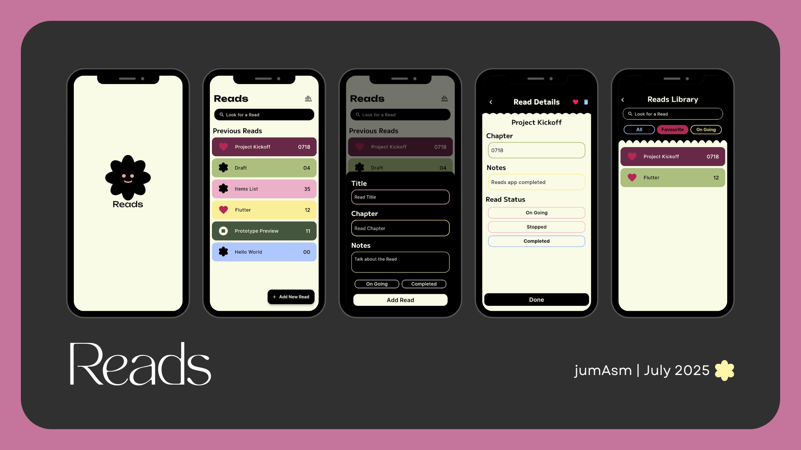

##  Reads – Personal Reading Tracker App (Built with Flutter)

**Reads** is a lightweight Flutter-based mobile application designed to help users log and manage their reading progress in a simple and visually friendly way.

---

### About the App

Reads was built as a personal solution to a real need:

> *"I often read from multiple sources and forget where I left off."*

With Reads, users can:

- Create and manage reading entries
- Track chapters or sections they've read
- Add personal notes
- Tag the read status: `On Going`, `Stopped`, or `Completed`
- Browse a clean and minimal read library

---

### UI Preview

---

### Tech Stack

- **Flutter** – for building the UI
- **Hive** – for lightweight local storage
- **Bloc (Cubit)** – for managing state
- **Lottie** – for animated splash screen
- **Firebase Hosting** – to deploy as a PWA

---

### Live Demo

Try it now: [https://reads-app-web.web.app](https://reads-app-web.web.app)

---

### Created by

**jumAsm**  
July 2025 
